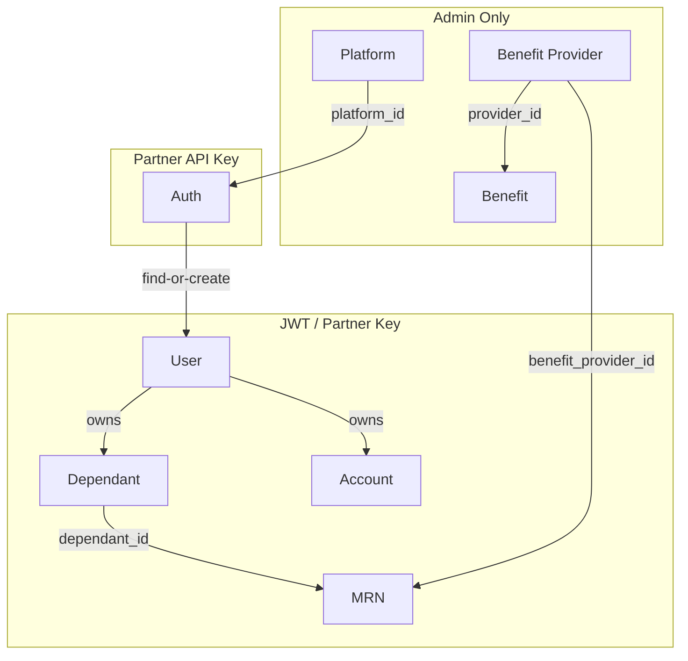
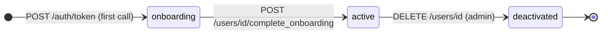

## Module Map

---

## Domains

<CardGroup cols={3}>
  <Card title="Auth" icon="key" color="#16a34a" href="/modules/auth">
    **Partner API key**

    Partners call `POST /auth/token` with a phone number. Aarokya creates the user on first call and issues a JWT. No OTP, no passwords.

    **Tables:** `users` (find-or-create)
  </Card>
  <Card title="Platform" icon="server" color="#f59e0b" href="/modules/platform">
    **Admin-only**

    Create and manage tenants (e.g. Namma Yatri). Every user belongs to one platform. Platform ID is required for token issuance.

    **Tables:** `platforms`
  </Card>
  <Card title="User" icon="user" color="#3b82f6" href="/modules/user">
    **JWT + Admin**

    Full user lifecycle — profile, onboarding, soft-delete. Self-access enforced: JWT users can only read/write their own record.

    **Tables:** `users`
  </Card>
  <Card title="Dependant" icon="user-group" color="#0891b2" href="/modules/dependant">
    **JWT self + Admin**

    Family members linked to a user. Immutable append-only rows — every update creates a new version. SELF dependant is system-managed.

    **Tables:** `dependants`
  </Card>
  <Card title="Benefit Provider" icon="building" color="#0891b2" href="/modules/benefit_provider">
    **Admin-only**

    Companies that offer benefits. Top-level catalogue grouping. A provider must exist before any benefit can reference it.

    **Tables:** `benefit_providers`
  </Card>
  <Card title="Benefit" icon="stethoscope" color="#7c3aed" href="/modules/benefit">
    **Admin write · JWT + Admin read**

    Individual offerings (consultation, insurance) linked to a provider. Admins manage the catalogue; active JWT users browse benefits.

    **Tables:** `benefits`
  </Card>
  <Card title="Account" icon="credit-card" color="#16a34a" href="/modules/account">
    **JWT self + Partner key**

    Stores a user's external account references (e.g. bank account number).

    **Tables:** `accounts`
  </Card>
  <Card title="MRN" icon="id-card" color="#dc2626" href="/modules/mrn">
    **JWT + Partner · Admin delete**

    Links a dependant to a benefit provider with an external Medical Record Number. Unique per `(dependant, provider)` pair.

    **Tables:** `mrns`
  </Card>
</CardGroup>

---

## Authentication Model

| Header | Scheme | Used by |
|--------|--------|---------|
| `admin-api-key` | Static secret | Internal ops — CRUD for platforms, providers, benefits |
| `api-key` | Static secret (per partner) | External partners — token issuance, account/MRN ops |
| `Authorization: Bearer <jwt>` | JWT (HS256) | Logged-in users — profile, dependants, accounts, MRNs |

No passwords, OTP flows, or refresh tokens. When the JWT expires, the partner backend calls `POST /auth/token` again.

---

## User Lifecycle

| Status | Meaning | Allowed operations |
|--------|---------|-------------------|
| `onboarding` | Created, profile incomplete | `PATCH /users/{id}`, `complete_onboarding` |
| `active` | Fully onboarded | All endpoints |
| `deactivated` | Soft-deleted | None |

---

## Shared Infrastructure

<CardGroup cols={3}>
  <Card title="server_wrap" icon="shield-check" color="#7c3aed">
    Single entry point for auth validation and error handling. Every handler calls `server_wrap(auth_guard, ...)` — no handler can skip auth accidentally.
  </Card>
  <Card title="Error Envelope" icon="triangle-exclamation" color="#dc2626">
    All errors return `{"error": {"code": "...", "message": "..."}}`. Switch on `code` (e.g. `MR-903`), not `message`.
  </Card>
  <Card title="OpenAPI / Swagger" icon="book" color="#0891b2">
    Swagger UI at `/api_docs/ui`. OpenAPI JSON at `/api_docs/openapi.json`. Generated from code via `utoipa`.
  </Card>
</CardGroup>
