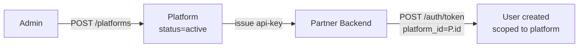

<Info>
  **Auth guard:** `admin-api-key` header required for all endpoints. No JWT or partner key access.
</Info>

## Overview

A **platform** is a logical tenant — it represents a partner app integrated with Aarokya (e.g. Namma Yatri, a hospital chain). Each partner is issued an API key tied to their platform. Users are registered under a specific platform, and their identity is scoped to `(platform_id, phone_number)`.

- **Name uniqueness is global.** No two platforms may share the same name.
- **Soft delete via status.** Deleting a platform sets `status → inactive`; it does not remove the row.

---

## Platform in the Auth Flow



---

## Auth Guards by Endpoint

| Endpoint | Admin key | Notes |
|----------|-----------|-------|
| `POST /platforms` | ✓ | Name must be unique |
| `GET /platforms` | ✓ | Filter by `status` |
| `GET /platforms/{id}` | ✓ | |
| `PATCH /platforms/{id}` | ✓ | Only `name` updatable |
| `DELETE /platforms/{id}` | ✓ | Sets `status → inactive` |

---

## Endpoints

<CardGroup cols={2}>
  <Card title="POST /platforms" icon="plus" color="#16a34a" href="/api/endpoints/platforms/create">
    Create a new platform. Name must be unique.
  </Card>
  <Card title="GET /platforms" icon="list" color="#3b82f6" href="/api/endpoints/platforms/list">
    Paginated list. Filter by `status`.
  </Card>
  <Card title="GET /platforms/{id}" icon="server" color="#3b82f6" href="/api/endpoints/platforms/get">
    Fetch a single platform by UUID.
  </Card>
  <Card title="PATCH /platforms/{id}" icon="pen" color="#8b5cf6" href="/api/endpoints/platforms/update">
    Rename a platform. New name must not conflict.
  </Card>
  <Card title="DELETE /platforms/{id}" icon="trash" color="#dc2626" href="/api/endpoints/platforms/delete">
    Soft-delete a platform (`status → inactive`).
  </Card>
</CardGroup>

---

## Request / Response Examples

<CodeGroup>
```bash Create a platform
curl -X POST http://localhost:8080/platforms \
  -H 'admin-api-key: your-admin-key' \
  -H 'Content-Type: application/json' \
  -d '{ "name": "Namma Yatri" }'
```

```json Response 201
{
  "id": "platform_3Xk9mNpQrBvLwJtY2c",
  "name": "Namma Yatri",
  "status": "active",
  "created_at": "2026-04-12T10:00:00Z",
  "last_modified_at": "2026-04-12T10:00:00Z"
}
```
</CodeGroup>

---

## Error Codes

| Code | HTTP | Description |
|------|------|-------------|
| `PE-200` | 500 | Internal server error |
| `PE-201` | 404 | Platform not found |
| `PE-202` | 409 | Name already exists |
| `PE-203` | 400 | Validation error (e.g. empty name) |
