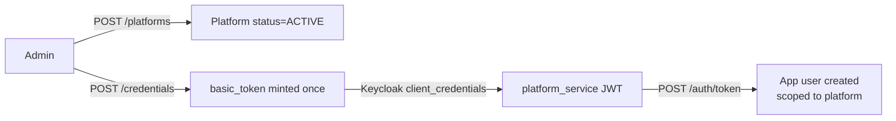

<Info>
  **Auth guard:** bearer JWT (`Authorization: Bearer <jwt>`). Platform CRUD requires an admin actor; per-tenant credential and dashboard-user sub-resources also admit a platform user scoped to the same `platform_id`.
</Info>

## Overview

A **platform** is a logical tenant — it represents a partner app integrated with Aarokya (e.g. Namma Yatri, a hospital chain). Each platform can hold one or more service-account *credentials* (used by the partner backend to mint tokens) and one or more dashboard *users* (humans who manage the tenant). End-users authenticated via [`POST /auth/token`](/modules/auth) carry the issuing `platform_id` in their token.

- **Name uniqueness is scoped to active platforms.** A deleted platform's name can be reused.
- **`slug` is immutable.** Set at creation, lowercase `[a-z0-9-]{2,40}`, used to build the Keycloak service-account `clientId`.
- **Soft delete via status.** Deleting a platform sets `status → INACTIVE`; it does not remove the row.

---

## Platform in the Auth Flow



A platform is created with no credentials. An admin (or a platform user scoped to the tenant) provisions a credential via `POST /platforms/{platform_id}/credentials`, which mints a Keycloak service-account client and returns a `basic_token` **once**. The partner backend exchanges that `basic_token` with Keycloak (`client_credentials`) for a `platform_service` bearer JWT, which it then uses to call `POST /auth/token`.

---

## Auth Guards by Endpoint

| Endpoint | Guard | Notes |
|----------|-------|-------|
| `POST /platforms` | Admin | Name must be unique among active platforms |
| `GET /platforms` | Admin (read-only admin OK) | Filter by `status` |
| `GET /platforms/{id}` | Admin, or platform actor for this `id` | |
| `PATCH /platforms/{id}` | Admin | Only `name` updatable |
| `DELETE /platforms/{id}` | Admin | Sets `status → INACTIVE` |
| `POST /platforms/{id}/credentials` | Admin, or platform user for this `id` | Mints a new credential each call |
| `GET /platforms/{id}/credentials` | Admin, or platform user for this `id` | Lists credential ids only |
| `DELETE /platforms/{id}/credentials/{cred_id}` | Admin, or platform user for this `id` | Idempotent |
| `POST /platforms/{id}/users` | Admin, or platform user for this `id` | Provisions a dashboard human |
| `GET /platforms/{id}/users` | Admin, or platform user for this `id` | |
| `DELETE /platforms/{id}/users/{keycloak_user_id}` | Admin, or platform user for this `id` | Idempotent |

---

## Endpoints

### Platform CRUD

<CardGroup cols={2}>
  <Card title="POST /platforms" icon="plus" color="#16a34a" href="/api/endpoints/platforms/create">
    Create a new platform (`name` + `slug`). Returns 201. No credentials are minted yet.
  </Card>
  <Card title="GET /platforms" icon="list" color="#3b82f6" href="/api/endpoints/platforms/list">
    Paginated list. Filter by `status`.
  </Card>
  <Card title="GET /platforms/{id}" icon="server" color="#3b82f6" href="/api/endpoints/platforms/get">
    Fetch a single platform by UUID.
  </Card>
  <Card title="PATCH /platforms/{id}" icon="pen" color="#8b5cf6" href="/api/endpoints/platforms/update">
    Rename a platform. New name must not conflict.
  </Card>
  <Card title="DELETE /platforms/{id}" icon="trash" color="#dc2626" href="/api/endpoints/platforms/delete">
    Soft-delete a platform (`status → INACTIVE`).
  </Card>
</CardGroup>

### Service-account credentials

<CardGroup cols={2}>
  <Card title="POST /platforms/{id}/credentials" icon="key" color="#16a34a" href="/api/endpoints/platforms/credentials_create">
    Mint a new credential. Returns `basic_token` once — store it now.
  </Card>
  <Card title="GET /platforms/{id}/credentials" icon="list" color="#3b82f6" href="/api/endpoints/platforms/credentials_list">
    List `credential_id`s for the platform. Never returns secrets.
  </Card>
  <Card title="DELETE /platforms/{id}/credentials/{credential_id}" icon="trash" color="#dc2626" href="/api/endpoints/platforms/credentials_revoke">
    Revoke one credential. Idempotent (`revoked: false` if absent).
  </Card>
</CardGroup>

### Dashboard users (per-tenant)

<CardGroup cols={2}>
  <Card title="POST /platforms/{id}/users" icon="user-plus" color="#16a34a" href="/api/endpoints/platforms/users_create">
    Provision a dashboard user. `temporary_password` shown once.
  </Card>
  <Card title="GET /platforms/{id}/users" icon="users" color="#3b82f6" href="/api/endpoints/platforms/users_list">
    List dashboard users scoped to this platform.
  </Card>
  <Card title="DELETE /platforms/{id}/users/{keycloak_user_id}" icon="user-minus" color="#dc2626" href="/api/endpoints/platforms/users_disable">
    Disable a dashboard user. Idempotent.
  </Card>
</CardGroup>

---

## Request / Response Examples

<CodeGroup>
```bash Create a platform
curl -X POST http://localhost:8080/platforms \
  -H 'Authorization: Bearer <admin-jwt>' \
  -H 'Content-Type: application/json' \
  -d '{ "name": "Namma Yatri", "slug": "namma-yatri" }'
```

```json Response 201
{
  "id": "0190b6c2-7e3a-7c6e-9b1d-2f4a8c1e5d33",
  "name": "Namma Yatri",
  "slug": "namma-yatri",
  "status": "ACTIVE",
  "created_at": "2026-04-12T10:00:00Z",
  "last_modified_at": "2026-04-12T10:00:00Z"
}
```

```bash Mint a credential
curl -X POST http://localhost:8080/platforms/0190b6c2-7e3a-7c6e-9b1d-2f4a8c1e5d33/credentials \
  -H 'Authorization: Bearer <admin-jwt>'
```

```json Credential 200
{
  "credential_id": "0190b6c2-9a11-7c6e-9b1d-2f4a8c1e5d44",
  "basic_token": "cGxhdGZvcm0tbmFtbWEteWF0cmkt..."
}
```
</CodeGroup>

<Warning>
  `basic_token` is returned **only** by `POST /credentials` and is never retrievable again. `GET /credentials` returns `credential_id`s only — no secrets.
</Warning>

---

## Error Codes

| Code | HTTP | Description |
|------|------|-------------|
| `PE_200` | 500 | Internal server error |
| `PE_201` | 404 | Platform not found |
| `PE_202` | 409 | Name already exists |
| `PE_203` | 400 | Validation error (e.g. empty name) |
| `PE_204` | 500 | Keycloak is not configured for this deployment |
| `PE_205` | 500 | Upstream Keycloak request failed |
