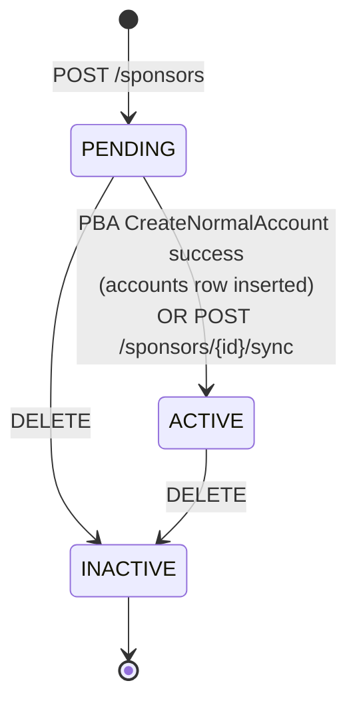
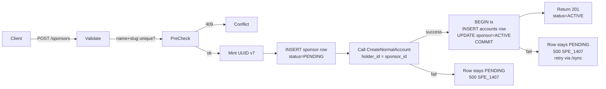

<Info>
  **Auth guard:** any **trusted-backend** actor — admin keys, benefit-provider human/service users, and platform human/service users. App users (JWT) are forbidden.
</Info>

## Overview

A **sponsor** is a donor entity — an individual person or an organisation (trust, CSR fund, society, etc.) — that contributes funds toward matching driver insurance premiums. Each registered sponsor has an external "normal account" on the ledger provider (PBA today) that holds its balance. Subsidies later flow out of the sponsor's normal account into individual users' purpose-bound (PB) accounts via separate transfer operations.

This module covers **registration only** — the contribution / transfer ledger is a separate concern.

- **Generic discriminant**: `SponsorKind = INDIVIDUAL | ORGANISATION`. Per-kind detail payloads live in a typed JSONB union.
- **Three-stage lifecycle**: `PENDING → ACTIVE → INACTIVE`. Sponsors are born PENDING and transition to ACTIVE when their PBA normal-account is provisioned and linked.
- **Account row, not column**: a sponsor's PBA `provider_account_id` lives as a row in the `accounts` table (`holder = sponsor:<sponsor_id>` + `account_type = SPONSOR`). The `sponsors` row itself carries identity and lifecycle only.
- **Recovery path**: `POST /sponsors/{id}/sync` re-links a sponsor whose `create` succeeded at PBA but failed locally afterwards (idempotent on ACTIVE).

---

## Lifecycle



ACTIVE → PENDING and INACTIVE → anywhere are rejected with `409 SPE_1404` (`SponsorNotActivatable`).

---

## POST flow



Two writes are split for safety:

1. **Sponsor row INSERT** — single statement, outside any transaction. Gated by partial-unique indexes on `name` and `slug`.
2. **PBA `CreateNormalAccount`** — network call. Held outside any DB transaction so the connection pool doesn't stall on PBA latency.
3. **Atomic local link** — inside `transaction_async`: INSERT the `accounts` row (`holder = sponsor:<id>`, `account_type = SPONSOR`, `external_account_id = pba_resp.provider_account_id`) and flip `sponsor.status = ACTIVE`.

If step 2 fails the sponsor stays PENDING with no `accounts` row — recover via `POST /sponsors/{id}/sync`. If step 3 fails after step 2 succeeded, the same `/sync` path recovers (it re-attempts the atomic link).

---

## Status enum

| Value | Meaning |
|---|---|
| `PENDING` | Local row created; linked `accounts` row not yet present. |
| `ACTIVE` | PBA normal-account provisioned and linked via the `accounts` table (`holder = sponsor:<id>`, `account_type = SPONSOR`). Ready to receive contributions. |
| `INACTIVE` | Soft-deleted via `DELETE /sponsors/{id}`. Frees `name` and `slug` for reuse. |

---

## Sponsor kind + details

| Kind | Details payload |
|---|---|
| `INDIVIDUAL` | `IndividualSponsorDetails` — `first_name` (required); `last_name`, `email`, `phone` (optional) |
| `ORGANISATION` | `OrganisationSponsorDetails` — `legal_name` (required); `registration_number`, `contact` (optional). `contact` is a `ContactDetails` block: `email`, `phone`, `person_first_name`, `person_last_name` (all optional) |

The `sponsor_details` JSON discriminator (`sponsor_kind` key) must match the top-level `sponsor_kind` field. A mismatch on **create** is a `400 SPE_1405` (validation error); a mismatch on **update** (`sponsor_details` variant vs the stored `sponsor_kind`) is a `400 SPE_1402`.

---

## Auth Guards

| Endpoint | Trusted-backend | Notes |
|----------|-----------------|-------|
| `POST /sponsors` | ✓ | PBA `CreateNormalAccount` runs inline; on success the linking `accounts` row is inserted and the sponsor flips to ACTIVE in a single transaction. PBA failure leaves the row PENDING — recover via `POST /{id}/sync`. |
| `GET /sponsors` | ✓ | Filter by `statuses` and/or `sponsor_kinds` (comma-separated, multi-select; same shape as `GET /users`) |
| `GET /sponsors/{sponsor_id}` | ✓ | |
| `PATCH /sponsors/{sponsor_id}` | ✓ | Mutable fields: `name`, `pan`, `address`, `sponsor_details`. `slug`, `sponsor_kind`, and `status` are **not** patchable here — `status` is owned by the create / sync / soft-delete paths. |
| `POST /sponsors/{sponsor_id}/sync` | ✓ | Recovery — link a PENDING sponsor whose `create` succeeded at PBA but failed locally afterwards. Idempotent on ACTIVE. |
| `DELETE /sponsors/{sponsor_id}` | ✓ | Soft-delete (`status → INACTIVE`). Idempotent. |
| `GET /sponsors/{sponsor_id}/balance` | ✓ | PBA proxy. Sponsor must be ACTIVE. |
| `GET /sponsors/{sponsor_id}/transactions` | ✓ | PBA proxy. Pagination + date range. Sponsor must be ACTIVE. |
| `POST /sponsors/{sponsor_id}/deposit` | ✓ | Add funds to sponsor's normal account. Sponsor must be ACTIVE. |
| `POST /sponsors/{sponsor_id}/contribute` | ✓ | Sponsor → user HSA transfer. Targets a specific `insurance_policy_id`; policy must be in `APPROVED` status. |

---

## Endpoints

<CardGroup cols={2}>
  <Card title="POST /sponsors" icon="plus" color="#16a34a" href="/api/endpoints/sponsors/create">
    Register a new sponsor + optionally provision its external normal account inline.
  </Card>
  <Card title="GET /sponsors" icon="list" color="#3b82f6" href="/api/endpoints/sponsors/list">
    Paginated list. Filter by `statuses` and/or `sponsor_kinds` (comma-separated, multi-select).
  </Card>
  <Card title="POST /sponsors/{id}/sync" icon="rotate" color="#16a34a" href="/api/endpoints/sponsors/sync">
    Recovery path. Link a PENDING sponsor to its existing PBA normal account.
  </Card>
  <Card title="GET /sponsors/{id}" icon="user-group" color="#3b82f6" href="/api/endpoints/sponsors/get">
    Fetch a single sponsor by UUID.
  </Card>
  <Card title="PATCH /sponsors/{id}" icon="pen" color="#8b5cf6" href="/api/endpoints/sponsors/update">
    Update mutable fields. `slug` and `sponsor_kind` are immutable.
  </Card>
  <Card title="DELETE /sponsors/{id}" icon="trash" color="#dc2626" href="/api/endpoints/sponsors/delete">
    Soft-delete (`status → INACTIVE`).
  </Card>
  <Card title="GET /sponsors/{id}/balance" icon="wallet" color="#3b82f6" href="/api/endpoints/sponsors/balance">
    Current balance on the sponsor's normal account at PBA.
  </Card>
  <Card title="GET /sponsors/{id}/transactions" icon="list-ul" color="#3b82f6" href="/api/endpoints/sponsors/transactions">
    Paginated ledger from PBA. Supports date-range filters.
  </Card>
  <Card title="POST /sponsors/{id}/deposit" icon="arrow-down" color="#16a34a" href="/api/endpoints/sponsors/deposit">
    Add funds to the sponsor's normal account.
  </Card>
  <Card title="POST /sponsors/{id}/contribute" icon="arrow-right" color="#16a34a" href="/api/endpoints/sponsors/contribute">
    Sponsor → user HSA transfer for a specific `insurance_policy_id`.
  </Card>
</CardGroup>

---

## Fields

| Field | Type | Notes |
|-------|------|-------|
| `id` | UUID v7 | Server-generated. Passed to PBA as `holder_id`. |
| `sponsor_kind` | `INDIVIDUAL \| ORGANISATION` | Immutable after creation. |
| `name` | string | Required. Human-presentable. Partial-unique across active sponsors. |
| `slug` | string | Required. Lowercase `[a-z0-9-]{2,40}`. Immutable. Partial-unique across active sponsors. |
| `status` | enum | `PENDING` (default) / `ACTIVE` / `INACTIVE`. |
| `pan` | string \| null | Indian PAN format `[A-Z]{5}[0-9]{4}[A-Z]`. Optional. |
| `address` | AddressDetails \| null | Optional. |
| `sponsor_details` | typed JSONB union | Per-kind identity payload. Variant must match `sponsor_kind`. |
| `bank_details` (POST only) | BankDetails \| null | Optional. Pass-through to PBA's `origin_*`; never persisted. |
| `created_at`, `last_modified_at` | ISO 8601 datetime | UTC. |

---

## PII / Secret Policy

| Field | Treatment |
|-------|-----------|
| `bank_details.account_number` (POST only) | `Secret<String>` end-to-end; never logged, never persisted. |
| `bank_details.ifsc_code` | Plain string; not PII. |
| `pan` | Plain string; persisted in the `pan` column. |
| `address` | Plain JSONB. |
| `sponsor_details.email` / `.phone` / `.contact_*` | Plain JSONB. Format validation deferred to a separate PR. |

---

## Examples

<CodeGroup>
```bash Create Individual
curl -X POST http://localhost:8080/sponsors \
  -H 'Authorization: Bearer <trusted-backend-token>' \
  -H 'Content-Type: application/json' \
  -d '{
    "sponsor_kind": "INDIVIDUAL",
    "name": "Asha Rao",
    "slug": "asha-rao",
    "sponsor_details": {
      "sponsor_kind": "INDIVIDUAL",
      "first_name": "Asha",
      "last_name": "Rao",
      "email": "asha@example.com"
    },
    "pan": "ABCPR1234X",
    "bank_details": {
      "ifsc_code": "HDFC0000123",
      "account_number": "50100123456789"
    }
  }'
```

```bash Create Organisation
curl -X POST http://localhost:8080/sponsors \
  -H 'Authorization: Bearer <trusted-backend-token>' \
  -H 'Content-Type: application/json' \
  -d '{
    "sponsor_kind": "ORGANISATION",
    "name": "Tata Mobility Trust",
    "slug": "tata-mobility-trust",
    "sponsor_details": {
      "sponsor_kind": "ORGANISATION",
      "legal_name": "Tata Mobility Trust",
      "registration_number": "TRUST-2024-001",
      "contact": {
        "email": "ops@tata-mobility.in"
      }
    }
  }'
```

```json Response 201
{
  "id": "0194e0f3-4b2a-7123-8f4a-9d5e2c8b1a3d",
  "sponsor_kind": "INDIVIDUAL",
  "name": "Asha Rao",
  "slug": "asha-rao",
  "status": "ACTIVE",
  "pan": "ABCPR1234X",
  "address": null,
  "sponsor_details": { "sponsor_kind": "INDIVIDUAL", "first_name": "Asha", "last_name": "Rao", "email": "asha@example.com" },
  "created_at": "2026-05-14T10:00:00Z",
  "last_modified_at": "2026-05-14T10:00:00Z"
}
```
</CodeGroup>

The sponsor's PBA `provider_account_id` is **not** on this response — it lives on the linked `accounts` row (`holder = sponsor:<id>`, `account_type = SPONSOR`). Fetch via `GET /accounts?holder=sponsor:<id>` (admin) if needed.

---

## Reconciliation flow

If PBA's `CreateNormalAccount` succeeds but the local link transaction fails (rare), the sponsor row stays in `PENDING` with no `accounts` row. PBA has the account; we just couldn't write the linkage locally.

Recovery — `POST /sponsors/{id}/sync`:

1. Operator pulls the `provider_account_id` from PBA's admin surface.
2. `POST /sponsors/{id}/sync` with `{ "external_account_id": "<pba_account_id>" }`.
3. Server verifies PBA's `holder_id` matches our `sponsor_id`, then atomically INSERTs the `accounts` row and flips the sponsor to ACTIVE.
4. Idempotent — if the sponsor is already ACTIVE, returns the current row as 200 without any PBA call.

Once PBA exposes a "find normal account by holder_id" endpoint, the request body becomes empty and the server resolves the id internally (see `TODO(pba-find-by-holder)` in `core::sponsor::sync_sponsor`).

---

## Error Codes

| Code | HTTP | Description |
|------|------|-------------|
| `SPE_1400` | 500 | Internal server error |
| `SPE_1401` | 404 | Sponsor not found |
| `SPE_1402` | 400 | `sponsor_details` variant does not match stored `sponsor_kind` |
| `SPE_1403` | 409 | Sponsor is already linked to an external account |
| `SPE_1404` | 409 | Sponsor cannot be activated from its current state (e.g. INACTIVE on `/sync`) |
| `SPE_1405` | 400 | Validation error (empty name, invalid slug, malformed PAN, half-supplied bank details, etc.) |
| `SPE_1406` | 409 | Uniqueness violation (slug collision) |
| `SPE_1407` | 500 | External account provisioning failed (PBA call errored) |
| `SPE_1408` | 409 | Sponsor is not active (no linked `accounts` row); cannot proxy to PBA |
| `SPE_1409` | 500 | PBA reports the external account is unknown |
| `SPE_1410` | 500 | PBA deposit call failed |
| `SPE_1411` | 409 | Insurance policy is not in `APPROVED` status; contribution rejected |
| `SPE_1412` | 409 | User has no active HSA account |
| `SPE_1413` | 500 | PBA transfer call failed |
| `SPE_1414` | 500 | PBA read (balance / transactions) failed |
| `SPE_1415` | 404 | Insurance policy not found |
