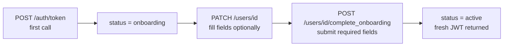

<Info>
  **Auth guards vary by endpoint** — JWT users can only access their own record. Admin key has full access.
</Info>

## Overview

User rows are **created by the Auth module** on first `POST /auth/token`. This module owns everything after creation: profile reads and writes, the onboarding transition, and soft-deletion. Phone number and user ID are immutable once set.

---

## Onboarding Flow

New users start with `status = onboarding`. Calling `POST /users/{user_id}/complete_onboarding` transitions them to `active` and returns a fresh JWT.



Required fields for `complete_onboarding`: `first_name`, `last_name`, `dob`, `gender`, `address`.

---

## Auth Guards by Endpoint

| Endpoint | JWT user | Admin key | Notes |
|----------|----------|-----------|-------|
| `GET /users` | — | ✓ | Admin only |
| `GET /users/{user_id}` | ✓ own only | ✓ | 403 if `jwt.sub != user_id` |
| `PATCH /users/{user_id}` | ✓ own only | ✓ | Allowed while `onboarding` |
| `POST /users/{user_id}/complete_onboarding` | ✓ only | — | No admin path |
| `DELETE /users/{user_id}` | — | ✓ | Admin only |

---

## Endpoints

<CardGroup cols={2}>
  <Card title="GET /users" icon="list" color="#f59e0b" href="/api/endpoints/users/list">
    **Admin only.** Paginated list of all users. Filter by `status`.
  </Card>
  <Card title="GET /users/{user_id}" icon="user" color="#3b82f6" href="/api/endpoints/users/get">
    Fetch a user profile. JWT users can only fetch their own record.
  </Card>
  <Card title="PATCH /users/{user_id}" icon="pen" color="#8b5cf6" href="/api/endpoints/users/update">
    Partial profile update. Send only changed fields. Allowed while `onboarding` or `active`.
  </Card>
  <Card title="POST /users/{user_id}/complete_onboarding" icon="circle-check" color="#16a34a" href="/api/endpoints/users/complete-onboarding">
    Submit required fields and transition `status → active`. Returns fresh JWT.
  </Card>
  <Card title="DELETE /users/{user_id}" icon="trash" color="#dc2626" href="/api/endpoints/users/delete">
    **Admin only.** Soft-delete a user (`status → deactivated`).
  </Card>
</CardGroup>

---

## Request / Response Examples

<CodeGroup>
```bash Complete onboarding
curl -X POST http://localhost:8080/users/047382910564/complete_onboarding \
  -H 'Authorization: Bearer eyJhbGci...' \
  -H 'Content-Type: application/json' \
  -d '{
    "first_name": "Ravi",
    "last_name": "Kumar",
    "dob": "1990-05-15",
    "gender": "MALE",
    "address": {
      "line1": "42 MG Road",
      "city": "Bengaluru",
      "state": "Karnataka",
      "pincode": "560034",
      "country": "IN"
    }
  }'
```

```json Response 201
{
  "user": { "user_id": "047382910564", "status": "ACTIVE", "..." : "..." },
  "access_token": "eyJhbGciOiJIUzI1NiIsInR5cCI6IkpXVCJ9..."
}
```
</CodeGroup>

---

## Error Codes

| Code | HTTP | Description |
|------|------|-------------|
| `UE-100` | 500 | Internal server error |
| `UE-101` | 404 | User not found |
| `UE-102` | 400 | Validation error |
| `UE-103` | 500 | Encryption error |
