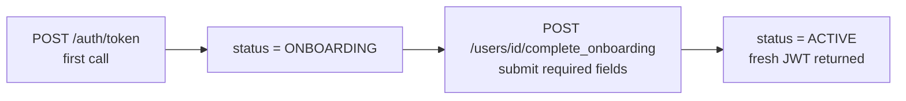

<Info>
  **Auth guards vary by endpoint** — JWT users can only access their own record. Admin key has full access.
</Info>

## Overview

User rows are **created by the Auth module** on first `POST /auth/token`. This module owns everything after creation: profile reads and writes, the onboarding transition, and soft-deletion. Phone number and user ID are immutable once set.

---

## Onboarding Flow

New users start with `status = ONBOARDING`. Calling `POST /users/{user_id}/complete_onboarding` transitions them to `ACTIVE` and returns a fresh JWT.



Required fields for `complete_onboarding`: `salutation`, `first_name`, `last_name`, `dob`, `gender`, `address`, and `bank_details` (`ifsc_code` + `account_number`). `email` is optional. Submitting these also seeds the user's accounts and creates the system-managed `SELF` dependant.

<Note>
`PATCH /users/{user_id}` is **not** part of the onboarding path — an app user can only `PATCH` once they are `ACTIVE`. While `ONBOARDING`, profile fields are submitted through `complete_onboarding`.
</Note>

---

## Auth Guards by Endpoint

| Endpoint | JWT user | Admin key | Notes |
|----------|----------|-----------|-------|
| `GET /users` | — | ✓ | Admin only (`require_admin`, readonly admin allowed) |
| `GET /users/{user_id}` | ✓ | ✓ | No per-handler owner check — see note below |
| `PATCH /users/{user_id}` | ✓ own only | ✓ | App user must be `ACTIVE` and own the record |
| `POST /users/{user_id}/complete_onboarding` | ✓ own only | — | App user must own the record and be `ONBOARDING`; caller must be platform-associated |
| `DELETE /users/{user_id}` | — | ✓ | Admin only (non-readonly) |

<Note>
`GET /users/{user_id}` currently has no owner assertion at the handler or core layer — any authenticated caller who knows a `user_id` can read that profile. Treat ownership scoping as enforced only on the write and onboarding paths.
</Note>

---

## Searching & Filtering Users

`GET /users` accepts optional, **AND-combined** query parameters. All three search
filters are **case-insensitive prefix** matches (`starts-with`), not substring.

| Query param | Matches | Example |
|-------------|---------|---------|
| `name` | Prefix of the **first name**, **last name**, or **full name** (`first last`), case-insensitive | `?name=ravi`, `?name=ravi%20kumar` |
| `phone` | Phone number prefix (local number, no country code) | `?phone=9876` |
| `user_id` | 12-digit user-id prefix (partial ids accepted) | `?user_id=0123` |
| `statuses` | Comma-separated `UserStatus` (`IN (...)`) | `?statuses=ACTIVE,ONBOARDING` |
| `start_time` / `end_time` | `created_at` range | `?start_time=2026-01-01T00:00:00` |
| `sort_on` / `sort_by` | Sort column / direction (default `created_at` / `desc`) | `?sort_on=created_at&sort_by=asc` |
| `limit` / `offset` | Pagination (limit clamped to the server max) | `?limit=20&offset=40` |

<Note>
Prefix means `?name=ravi` matches "Ravi" and "Ravikumar" but **not** "Shravi".
Search terms are sanitized to alphanumerics + spaces, and must contain **at
least 3 alphanumeric characters** — shorter or symbol-only terms (e.g. a blank
`?name=`) are ignored, not treated as match-everything.
</Note>

---

## Endpoints

<CardGroup cols={2}>
  <Card title="GET /users" icon="list" color="#f59e0b" href="/api/endpoints/users/list">
    **Admin only.** Paginated list of users. Filter by `statuses`, creation
    `time_range`, and search by `name` / `phone` / `user_id`.
  </Card>
  <Card title="GET /users/{user_id}" icon="user" color="#3b82f6" href="/api/endpoints/users/get">
    Fetch a user profile. JWT users can only fetch their own record.
  </Card>
  <Card title="PATCH /users/{user_id}" icon="pen" color="#8b5cf6" href="/api/endpoints/users/update">
    Partial profile update. Send only changed fields (`first_name`, `last_name`, `email`, `dob`, `gender`, `address`). App user must be `ACTIVE`.
  </Card>
  <Card title="POST /users/{user_id}/complete_onboarding" icon="circle-check" color="#16a34a" href="/api/endpoints/users/complete-onboarding">
    Submit required fields and transition `status → ACTIVE`. Returns fresh JWT.
  </Card>
  <Card title="DELETE /users/{user_id}" icon="trash" color="#dc2626" href="/api/endpoints/users/delete">
    **Admin only.** Soft-delete a user (`status → DEACTIVATED`).
  </Card>
</CardGroup>

---

## Request / Response Examples

<CodeGroup>
```bash Complete onboarding
curl -X POST http://localhost:8080/users/047382910564/complete_onboarding \
  -H 'Authorization: Bearer eyJhbGci...' \
  -H 'Content-Type: application/json' \
  -d '{
    "salutation": "MR",
    "first_name": "Ravi",
    "last_name": "Kumar",
    "dob": "1990-05-15",
    "gender": "MALE",
    "address": {
      "line1": "42 MG Road",
      "city": "Bengaluru",
      "state": "Karnataka",
      "pincode": "560034",
      "country": "IN"
    },
    "bank_details": {
      "ifsc_code": "HDFC0001234",
      "account_number": "50100123456789"
    },
    "email": "ravi.kumar@example.com"
  }'
```

```json Response 200
{
  "user": { "user_id": "047382910564", "status": "ACTIVE", "..." : "..." },
  "access_token": "eyJhbGciOiJIUzI1NiIsInR5cCI6IkpXVCJ9..."
}
```
</CodeGroup>

---

## Error Codes

| Code | HTTP | Description |
|------|------|-------------|
| `UE_100` | 500 | Internal server error |
| `UE_101` | 404 | User not found |
| `UE_102` | 400 | Validation error |
| `UE_103` | 400 | A user with the supplied email or phone number already exists |
| `UE_104` | 500 | Failed to allocate a unique user id |
| `UE_105` | 500 | Upstream PBA call failed during onboarding |
| `UE_106` | 500 | Failed to persist onboarding state |
