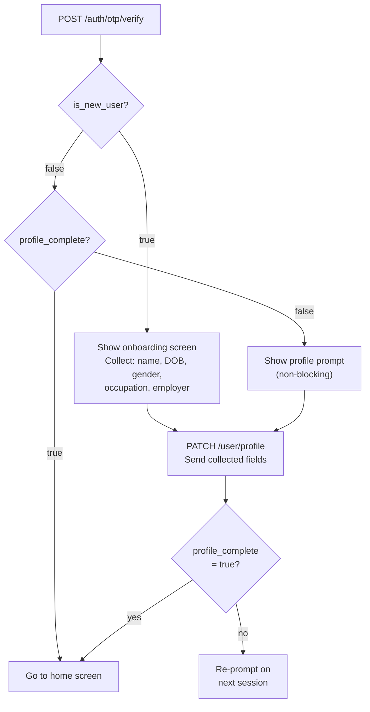
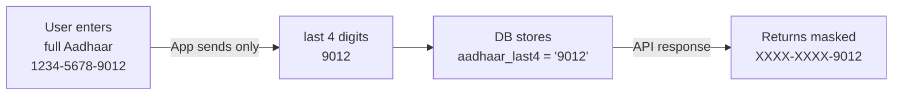

<Info>
  **Authentication:** All endpoints require `Authorization: Bearer <access_token>`.
</Info>

## Overview

The user row is **created by the Auth module** on first login. This module reads and writes the profile fields on top of it. The User Profile module does not create users — it only enriches them.

<CardGroup cols={2}>
  <Card title="Updatable Fields" icon="pen" color="#3b82f6">
    `first_name` · `last_name` · `email` · `dob` · `gender` · `address` · `occupation` · `employer`
  </Card>
  <Card title="Immutable Fields" icon="lock" color="#dc2626">
    `phone` — identity anchor, set by Auth and never changed. `aadhaar_last4` — set via a separate KYC flow; returns 400 if attempted via PATCH.
  </Card>
</CardGroup>

---

## Endpoints

| Method | Path | Description |
|--------|------|-------------|
| `GET` | `/user/profile` | Fetch authenticated user's full profile |
| `PATCH` | `/user/profile` | Partial update — send only fields you want to change |

---

## Profile Fields — Field by Field

| Field | Type | Description | Constraints |
|-------|------|-------------|-------------|
| `user_id` | UUID | Immutable primary key | Set at creation, never changes |
| `phone` | string | 10-digit mobile number, `+91` prefix stored | Immutable — identity anchor |
| `first_name` | string | Given name | Max 255 chars |
| `last_name` | string | Family name | Max 255 chars |
| `email` | string | Email address | Valid RFC 5322 email format |
| `dob` | string | Date of birth | `YYYY-MM-DD`; must be in the past; used for insurance age loading |
| `gender` | string | Gender identity | `Male` \| `Female` \| `Other` (see enum below) |
| `address` | string | Residential address | Free text; max 500 chars |
| `occupation` | string | Type of gig work | Enum — see `OccupationType` list below |
| `employer` | string | Platform / company name | Free text; max 255 chars; e.g. "Namma Yatri", "Swiggy" |
| `aadhaar_last4` | string | Last 4 digits of Aadhaar | Set via separate KYC; returned masked as `XXXXXXXX{last4}` |
| `profile_complete` | boolean | Computed flag | `true` when both `first_name` and `last_name` are set |

---

## Occupation Types

The `occupation` field accepts values from the `OccupationType` enum. These represent the primary gig work segments that Aarokya serves:

| Value | Description |
|-------|-------------|
| `Driver` | Cab / auto driver (Ola, Namma Yatri, Uber, etc.) |
| `Delivery Partner` | Package / food delivery rider (Swiggy, Zomato, Blinkit, etc.) |
| `Domestic Worker` | House cleaner, cook, nanny, etc. |
| `Construction Worker` | Daily-wage construction labourer |
| `Factory Worker` | Manufacturing / industrial floor worker |
| `Healthcare Worker` | Nursing aide, health worker, ASHA worker |
| `Retail Worker` | Kirana store, mall, or shop employee |
| `Security Guard` | Building / premises security |
| `Other` | Any gig work not listed above |

<Note>
  Occupation is used for analytics and product personalisation (e.g. surfacing plans relevant to outdoor workers vs indoor workers). It is not used for insurance underwriting — NH plans are not occupation-rated.
</Note>

---

## Gender Enum

| Value | Notes |
|-------|-------|
| `Male` | |
| `Female` | |
| `Other` | Inclusive catch-all for non-binary and prefer-not-to-say |

---

## `profile_complete` Flag — Semantics

The `profile_complete` boolean is a **computed field** — not a stored column. It is evaluated on every GET and returned in the response:

```text
profile_complete = (first_name IS NOT NULL AND first_name != '')
               AND (last_name IS NOT NULL AND last_name != '')
```

### What the app does with it

- `is_new_user: true` (from `/auth/otp/verify`) + `profile_complete: false` → show full onboarding screen with all fields
- `is_new_user: false` + `profile_complete: false` → user previously logged in but never completed their profile; show a lighter prompt
- `profile_complete: true` → skip onboarding; go directly to the home screen

### Why only name fields?

DOB and gender are required for insurance premium calculation, but they can be collected lazily — at the point when the user actually tries to buy insurance. Requiring all fields before entering the app creates unnecessary friction for users who just want to check their wallet balance or call a doctor.

### Transition effect

When `profile_complete` transitions from `false` to `true` (a PATCH that sets both name fields), the app should:
1. Dismiss the onboarding screen
2. Persist `profile_complete: true` in local state to avoid re-checking on every launch
3. (Optionally) trigger a "welcome" animation or confetti — the user has committed to the product

---

## Onboarding Flow



---

## PII Policy

### Aadhaar Masking Logic

The Aadhaar masking is applied in two places:

1. **Client-side (app):** The app's UI collects the full 12-digit Aadhaar number for display purposes, but sends **only the last 4 digits** to the API. The full number never travels over the network.
2. **Server-side (response):** The API always returns Aadhaar in masked format regardless of what is in the database.



| Field | What client sends | What DB stores | What API returns |
|-------|------------------|----------------|-----------------|
| Aadhaar | Last 4 digits only | `aadhaar_last4` = `"9012"` | `"XXXXXXXX9012"` |
| Phone | `9876543210` (10 digits) | `+919876543210` | `+919876543210` |
| Email | Plaintext | Plaintext | Plaintext |
| Name | Plaintext | Plaintext | Plaintext |
| DOB | `YYYY-MM-DD` | `DATE` column | `YYYY-MM-DD` |

### Why last-4 only?

Storing the full 12-digit Aadhaar number would classify Aarokya's database as a sensitive PII repository under DPDP Act 2023, requiring additional data protection compliance. The last 4 digits are sufficient for:
- Identity confirmation ("does this look like your Aadhaar?")
- Basic KYC for insurance — the exact 4-digit suffix is confirmed at claim time by NH

---

## Request / Response Examples

<CodeGroup>
```bash GET /user/profile
curl http://localhost:8080/user/profile \
  -H 'Authorization: Bearer eyJhbGci...'
```

```json Response 200
{
  "user_id": "a3f8c2d1-...",
  "phone": "9876543210",
  "first_name": "Priya",
  "last_name": "Kumar",
  "email": "priya@example.com",
  "dob": "1990-05-15",
  "gender": "Female",
  "aadhaar_last4": "XXXXXXXX1234",
  "address": "12, MG Road, Bengaluru",
  "occupation": "Driver",
  "employer": "Namma Yatri",
  "profile_complete": true
}
```

```json Response 401 — missing token
{
  "error": "MISSING_TOKEN",
  "message": "Authorization header is required",
  "status_code": 401
}
```
</CodeGroup>

<CodeGroup>
```bash PATCH /user/profile — full update
curl -X PATCH http://localhost:8080/user/profile \
  -H 'Authorization: Bearer eyJhbGci...' \
  -H 'Content-Type: application/json' \
  -d '{
    "first_name": "Priya",
    "last_name": "Sharma",
    "dob": "1990-05-15",
    "gender": "Female",
    "occupation": "Driver",
    "employer": "Namma Yatri"
  }'
```

```bash PATCH /user/profile — partial update (name only)
curl -X PATCH http://localhost:8080/user/profile \
  -H 'Authorization: Bearer eyJhbGci...' \
  -H 'Content-Type: application/json' \
  -d '{
    "first_name": "Priya",
    "last_name": "Sharma"
  }'
```

```json Response 200
{
  "user_id": "a3f8c2d1-...",
  "phone": "9876543210",
  "first_name": "Priya",
  "last_name": "Sharma",
  "dob": "1990-05-15",
  "gender": "Female",
  "occupation": "Driver",
  "employer": "Namma Yatri",
  "profile_complete": true
}
```

```json Response 400 — attempt to update phone
{
  "error": "VALIDATION_ERROR",
  "message": "phone and aadhaar cannot be updated via this endpoint",
  "status_code": 400
}
```

```json Response 400 — invalid date
{
  "error": "INVALID_DATE_FORMAT",
  "message": "dob must be in YYYY-MM-DD format and must be a past date",
  "status_code": 400
}
```
</CodeGroup>

---

## Field Reference

| Field | Type | Constraints |
|-------|------|-------------|
| `first_name` | string | Max 255 chars |
| `last_name` | string | Max 255 chars |
| `email` | string | Valid email format (RFC 5322) |
| `dob` | string | `YYYY-MM-DD`, must be a past date |
| `gender` | string | `Male` \| `Female` \| `Other` |
| `address` | string | Free text, max 500 chars |
| `occupation` | string | See `OccupationType` enum above |
| `employer` | string | Max 255 chars |

<Warning>
  Sending `phone` or `aadhaar` in the PATCH body will return **400 Bad Request**. These are identity fields managed by dedicated flows.
</Warning>
