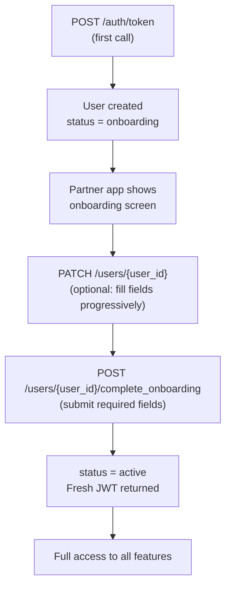

<Info>
  **Auth guards vary by endpoint** — see the table below. JWT users can only access their own record; admin key has full access.
</Info>

## Overview

The user row is **created by the Auth module** on first `POST /auth/token`. This module reads and writes the profile fields, manages the onboarding transition, and handles soft-deletion.

---

## Onboarding Flow

New users start with `status = onboarding`. They must call `POST /users/{user_id}/complete_onboarding` to transition to `active`.



### Required fields for onboarding

`complete_onboarding` requires: `first_name`, `last_name`, `dob`, `gender`, `address`.
`email` and `id_proof` are optional.

---

## Auth Guards by Endpoint

| Endpoint | JWT user | Admin key | Notes |
|----------|----------|-----------|-------|
| `GET /users` | — | ✓ | Admin only |
| `GET /users/{user_id}` | ✓ (own record only) | ✓ | Self-access enforced in core |
| `PATCH /users/{user_id}` | ✓ (onboarding + active) | ✓ | Allowed while onboarding |
| `POST /users/{user_id}/complete_onboarding` | ✓ (onboarding only) | — | User-only, no admin |
| `DELETE /users/{user_id}` | — | ✓ | Admin only |

**Self-access enforcement:** When a JWT user calls `GET /users/{user_id}` or `PATCH /users/{user_id}`, the server validates that `jwt.sub == path.user_id`. Attempting to access another user's record returns `403 Forbidden`.

---

## Profile Fields

| Field | Type | Required at onboarding | Notes |
|-------|------|----------------------|-------|
| `user_id` | string | — | Immutable, set at creation |
| `phone_number` | string | — | Immutable, identity anchor |
| `phone_country_code` | string | — | Immutable |
| `first_name` | string | ✓ | |
| `last_name` | string | ✓ | |
| `dob` | string (date) | ✓ | `YYYY-MM-DD` format |
| `gender` | enum | ✓ | `male` \| `female` \| `other` |
| `address` | object | ✓ | See `AddressDetails` |
| `email` | string | — | Optional |
| `id_proof` | object | — | Optional at onboarding |
| `status` | enum | — | Read-only; set by server |

---

## Endpoints

<CardGroup cols={2}>
  <Card title="GET /users" icon="list" color="#f59e0b" href="/api/endpoints/users/list">
    **Admin only.** Paginated list of all users. Supports filtering by `status`, `start_time`, `end_time`.
  </Card>
  <Card title="GET /users/{user_id}" icon="user" color="#3b82f6" href="/api/endpoints/users/get">
    Fetch a user by ID. JWT users can only fetch their own record. Admin has full access.
  </Card>
  <Card title="PATCH /users/{user_id}" icon="pen" color="#8b5cf6" href="/api/endpoints/users/update">
    Partial profile update. Send only the fields you want to change. Allowed while `onboarding` or `active`.
  </Card>
  <Card title="POST /users/{user_id}/complete_onboarding" icon="circle-check" color="#16a34a" href="/api/endpoints/users/complete-onboarding">
    Submit required profile fields and transition `status → active`. Returns a fresh JWT with updated status claim.
  </Card>
  <Card title="DELETE /users/{user_id}" icon="trash" color="#dc2626" href="/api/endpoints/users/delete">
    **Admin only.** Soft-delete a user (sets `deleted_at`). Deleted users cannot receive new tokens.
  </Card>
</CardGroup>

---

## Request / Response Examples

<CodeGroup>
```bash Complete onboarding
curl -X POST http://localhost:8080/users/usr_7Hq4nMdKpRsXwYzA1b/complete_onboarding \
  -H 'Authorization: Bearer eyJhbGci...' \
  -H 'Content-Type: application/json' \
  -d '{
    "first_name": "Ravi",
    "last_name": "Kumar",
    "dob": "1990-05-15",
    "gender": "male",
    "address": {
      "line1": "42 MG Road",
      "city": "Bengaluru",
      "state": "Karnataka",
      "pincode": "560034",
      "country": "IN"
    }
  }'
```

```json Response 201 — onboarding complete
{
  "user": {
    "user_id": "usr_7Hq4nMdKpRsXwYzA1b",
    "phone_number": "9876543210",
    "phone_country_code": "+91",
    "first_name": "Ravi",
    "last_name": "Kumar",
    "dob": "1990-05-15",
    "gender": "male",
    "address": {
      "line1": "42 MG Road",
      "city": "Bengaluru",
      "state": "Karnataka",
      "pincode": "560034",
      "country": "IN"
    },
    "status": "active"
  },
  "access_token": "eyJhbGciOiJIUzI1NiIsInR5cCI6IkpXVCJ9..."
}
```
</CodeGroup>

<CodeGroup>
```bash Update profile (partial)
curl -X PATCH http://localhost:8080/users/usr_7Hq4nMdKpRsXwYzA1b \
  -H 'Authorization: Bearer eyJhbGci...' \
  -H 'Content-Type: application/json' \
  -d '{
    "email": "ravi@example.com"
  }'
```

```json Response 200
{
  "user_id": "usr_7Hq4nMdKpRsXwYzA1b",
  "phone_number": "9876543210",
  "phone_country_code": "+91",
  "first_name": "Ravi",
  "last_name": "Kumar",
  "email": "ravi@example.com",
  "status": "active"
}
```

```json Response 403 — accessing another user's record
{
  "error": {
    "code": "FORBIDDEN",
    "message": "access to this user is not allowed"
  }
}
```
</CodeGroup>

---

## Soft Delete

`DELETE /users/{user_id}` sets `deleted_at` on the user row — the record is never physically removed. A deleted user's phone number can be re-registered (a new user row is created on the next `POST /auth/token`).
