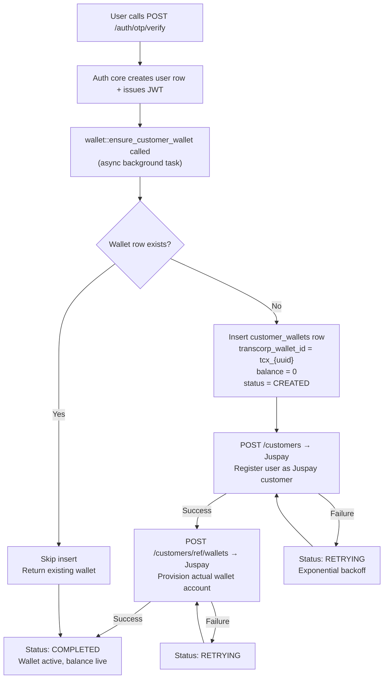
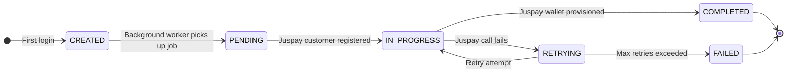
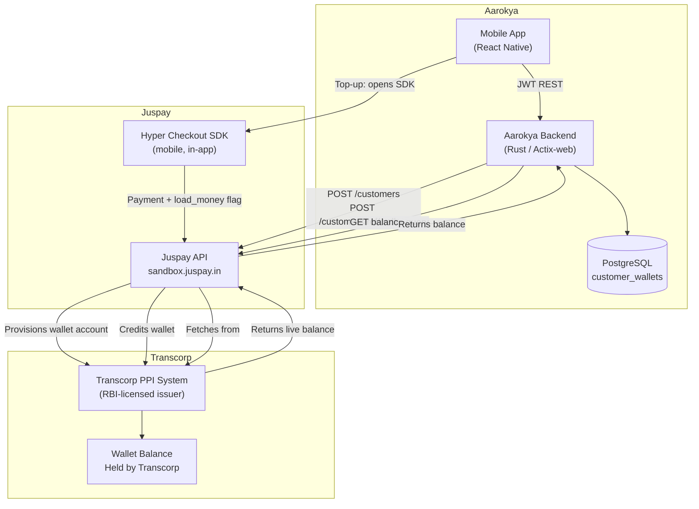
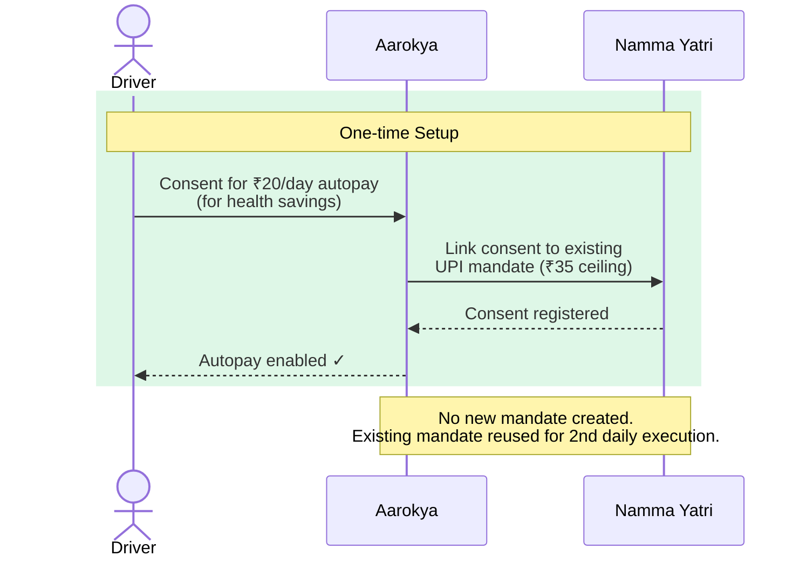
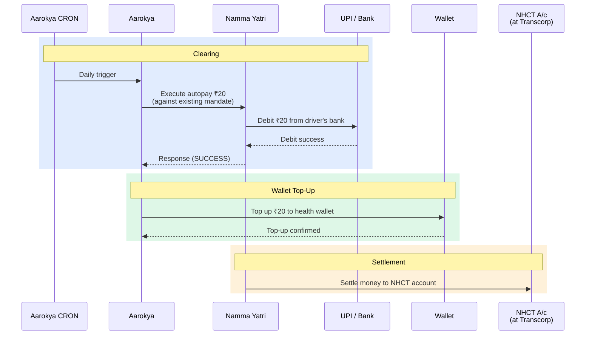
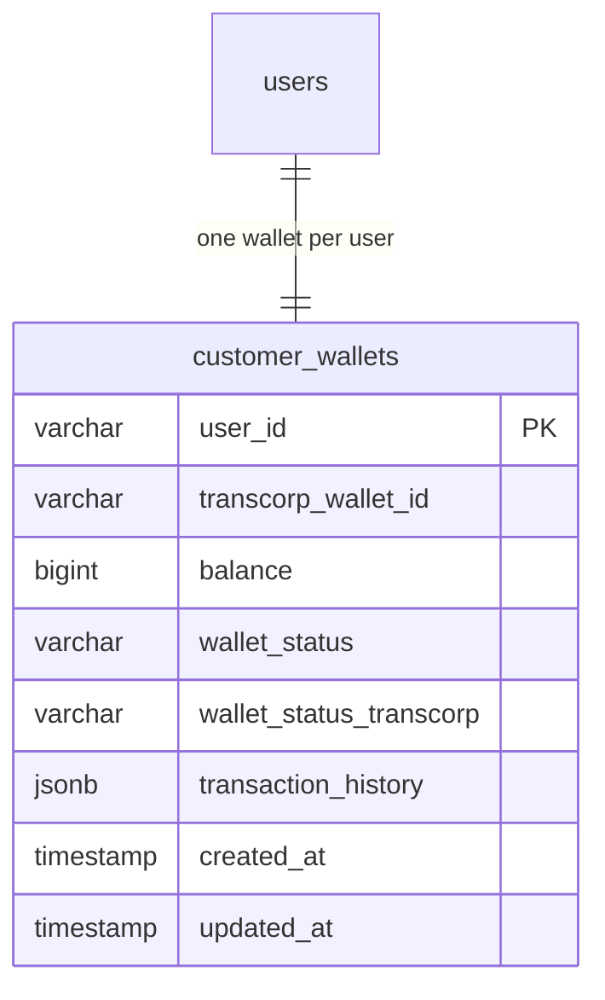

<Info>
  **Authentication:** All endpoints require `Authorization: Bearer <access_token>`.

  **Current state:** Wallet is a local stub — Transcorp/Juspay integration is in progress. All balance and history data is seeded locally.
</Info>

## What Is the Health Wallet?

The Aarokya health wallet is a **ring-fenced digital savings account** for healthcare expenses. Unlike a general-purpose prepaid wallet, money loaded into it can only flow toward medical expenses — consultations, pharmacy, insurance premiums, and hospitalisation costs at network hospitals.

It is powered by **Juspay** (payment orchestration) and **Transcorp** (the RBI-licensed PPI issuer). From a regulatory standpoint, it operates under the RBI's Prepaid Payment Instrument (PPI) framework.

### Who can contribute to the wallet?

One of the wallet's most powerful features is **multi-source funding**:

| Source | Example |
|--------|---------|
| Worker themselves | Weekly top-up via UPI |
| Employer | Namma Yatri contributes ₹200/month per driver |
| Platform | Swiggy health benefit linked to delivery milestones |
| Family member | Spouse tops up from their UPI |
| Government scheme | State health department direct transfer |

This design recognises that gig workers are at the intersection of multiple organisations that each have an incentive to keep them healthy.

---

## Provisioning Flow

The wallet is **automatically created** when the user first logs in — the app never needs to call `POST /wallet` explicitly (though it is safe to do so idempotently).



### Why async creation?

Calling Juspay's API synchronously during login would make login latency dependent on an external service. If Juspay has a 2-second response time, every first login would take 2+ seconds. If Juspay is unavailable, users could not log in at all.

Async provisioning:
1. Makes login fast regardless of external service latency
2. Isolates authentication availability from payment gateway availability
3. Allows retry logic without user-facing impact

<Note>
  Wallet creation is **async** — it never blocks the login response. The app should check wallet status before initiating payments. Status transitions: `CREATED` → `PENDING` → `IN_PROGRESS` → `COMPLETED` | `FAILED` | `RETRYING`
</Note>

---

## Wallet Status Reference

### `wallet_status` — Internal Provisioning State

This tracks the progress of Juspay/Transcorp wallet provisioning:

| Status | Meaning | App UX |
|--------|---------|--------|
| `CREATED` | Row created in DB; Juspay call not yet made | Show loading indicator on wallet tab |
| `PENDING` | Background worker has picked up the job | Show loading indicator |
| `IN_PROGRESS` | Juspay customer created; wallet creation in flight | Show loading indicator |
| `COMPLETED` | Wallet fully provisioned in Juspay | Show balance and top-up button |
| `FAILED` | All retries exhausted; manual intervention needed | Show "wallet unavailable" error with support CTA |
| `RETRYING` | Transient failure; retry scheduled | Show loading indicator with "setting up" message |

### `wallet_status_transcorp` — Live Juspay Status

This is the status as reported by Transcorp/Juspay in real time:

| Status | Meaning |
|--------|---------|
| `ACTIVE` | Wallet is live and can transact |
| `BLOCKED` | Wallet has been blocked (KYC issue, fraud flag, etc.) |
| `Unknown` | Wallet not yet provisioned in Juspay (initial state) |

### Full State Machine



---

## Transcorp — The RBI-Licensed PPI Issuer

### What Is Transcorp?

**Transcorp** is the Prepaid Payment Instrument (PPI) issuer licensed by the Reserve Bank of India. In practical terms, Transcorp is the regulated entity that *holds the wallet balance* on behalf of each user. Aarokya cannot directly issue a digital wallet — only an RBI-licensed PPI issuer can. Transcorp fills that role.

**Juspay** is the payment orchestration layer that sits between Aarokya's backend and Transcorp's core banking system. When Aarokya calls Juspay's API to register a customer or provision a wallet, Juspay translates those calls into the appropriate operations on Transcorp's PPI infrastructure.

From Aarokya's perspective:
- Aarokya Backend talks to **Juspay's API** (REST)
- Juspay talks to **Transcorp's PPI system** (internal — transparent to Aarokya)
- The user's money is held at **Transcorp**, not at Juspay and not at Aarokya

### The `transcorp_wallet_id`

Once a wallet is fully provisioned, Juspay returns a `transcorp_wallet_id` — an identifier that uniquely addresses the user's wallet account on Transcorp's system. This identifier looks like `wlm_jUT7wpiZAkpFFvaT` and is stored in Aarokya's `customer_wallets.transcorp_wallet_id` column.

Every subsequent balance query, top-up, and transaction history lookup uses this ID to address the correct Transcorp wallet. **All path parameters named `wallet_id` on the wallet endpoints refer to this `transcorp_wallet_id`.**

### Wallet Status from Transcorp

Transcorp (via Juspay) reports a live wallet status that is distinct from Aarokya's internal provisioning status:

| `wallet_status_transcorp` | Meaning |
|---------------------------|---------|
| `ACTIVE` | Wallet is live and can transact normally |
| `BLOCKED` | Wallet has been blocked — typically due to a KYC flag or fraud signal. Contact support. |
| `UNKNOWN` | Wallet not yet provisioned in Transcorp (initial state before provisioning completes) |

### Integration Architecture



### Third-Party Services

| Service | Role | What Aarokya calls |
|---------|------|--------------------|
| Juspay | Payment orchestration, Hyper Checkout SDK host, Transcorp intermediary | `POST /customers`, `POST /customers/{ref}/wallets`, payment session creation, balance queries |
| Transcorp | RBI-licensed PPI issuer — holds the actual wallet balance | Via Juspay API (indirect; Aarokya has no direct API calls to Transcorp) |

<Note>
  Aarokya's backend never calls Transcorp directly. All Transcorp operations go through Juspay's API. The `transcorp_wallet_id` is a Transcorp-internal identifier surfaced by Juspay and stored by Aarokya for routing subsequent wallet operations.
</Note>

---

## Juspay Integration Details

The wallet creation flow makes two sequential calls to Juspay:

### Step 1: Create Juspay Customer

```text
POST https://sandbox.juspay.in/customers
{
  "object_reference_id": "aarokya_{user_id}",
  "mobile_number": "9876543210",
  "email_address": "priya@example.com",
  "first_name": "Priya",
  "last_name": "Kumar"
}
```

### Step 2: Provision Wallet for Customer

```text
POST https://sandbox.juspay.in/customers/aarokya_{user_id}/wallets
{
  "object_reference_id": "wallet_{user_id}",
  "merchant_id": "cumta"
}
```

The `transcorp_wallet_id` returned in this call (e.g. `wlm_jUT7wpiZAkpFFvaT`) is stored in `customer_wallets.transcorp_wallet_id` and used for all subsequent balance and transaction queries.

---

## Endpoints

| Method | Path | Description |
|--------|------|-------------|
| `GET` | `/wallet` | Wallet summary — includes `transcorp_wallet_id` |
| `POST` | `/wallet` | Idempotent create — safe to call multiple times |
| `GET` | `/wallet/{wallet_id}/balance` | Balance + linked status (live Juspay query) |
| `GET` | `/wallet/{wallet_id}/status` | Wallet creation status enum |
| `GET` | `/wallet/{wallet_id}/transactions/history/{number_of_days}` | Local ledger (max 10 entries) |

---

## Autopay Wallet Top-Up (Habit Forming)

In addition to manual top-ups via Juspay Hyper Checkout, Aarokya supports **automated daily wallet top-ups** via UPI autopay mandates through Namma Yatri. This is the primary funding mechanism for drivers — small, frictionless daily contributions to their health savings.

<Info>
  **Aarokya is an SDK embedded inside the Namma Yatri app.** The user gives consent within the Aarokya UI (inside Namma Yatri), while the actual UPI mandate execution happens through Namma Yatri's payment infrastructure.
</Info>

### Mandate Context

Namma Yatri drivers already have a UPI autopay mandate (up to **₹35 per execution**) used for ₹25/day regular platform usage. The same mandate is executed a **second time each day** for ₹20 toward health savings — no new mandate is created.

| Execution | Purpose | Amount | Within ₹35 ceiling? |
|-----------|---------|--------|----------------------|
| 1st (existing) | Regular Namma Yatri usage | ₹25 | Yes |
| 2nd (new) | Aarokya health savings | ₹20 | Yes |

The mandate ceiling is a **per-execution limit**, so both executions are valid independently.

### Phase 1: Enable Autopay (One-time Consent)



### Phase 2: Daily Execution (CRON)



### Funding Sources Summary

| Method | Trigger | Amount | Frequency |
|--------|---------|--------|-----------|
| **UPI Autopay** (Namma Yatri mandate) | Daily CRON | ₹20 | Daily |
| **Manual top-up** (Juspay Hyper Checkout) | User-initiated | Variable | On-demand |
| **Employer contribution** | Platform-initiated | Variable | Monthly |

---

## Payment Sessions

The wallet is funded and used via Juspay payment sessions. There are two payment types, each with different Juspay session configuration:

### WALLET_TOPUP — Adding Money

Used when the user wants to add money to their health wallet from an external UPI/card/netbanking source.

- Juspay session includes `payment_rules.load_money` flag
- After `SUCCESS`, Juspay credits the wallet balance
- Balance is refreshed from Juspay on the next `/wallet/{id}/balance` call

### INSURANCE — Paying Premium

Used when the user is paying an insurance premium. The money does NOT go through the health wallet — it goes directly to Narayana Health as a payment.

- Juspay session does NOT include `payment_rules.load_money`
- After `SUCCESS`, `POST /insurance/purchase` creates the policy record

| | WALLET_TOPUP | INSURANCE |
|--|--------------|-----------|
| Juspay session type | Includes `payment_rules.load_money` | Standard payment session |
| Money flows to | User's health wallet | Narayana Health |
| Status check path | `wallet.topup.status` | Top-level `status` |
| Post-success action | Refresh wallet balance | Call `POST /insurance/purchase` |

<Tip>
  When the user pays insurance premium from their wallet balance, use `INSURANCE` type and set the payment instrument to the wallet (`CUMTA_WALLET`). This deducts from the wallet balance and pays NH in a single step.
</Tip>

---

## Transaction History

The `number_of_days` path parameter controls the filter window:

| Value | Behaviour |
|-------|-----------|
| `0` | All history (no time filter) |
| `1–365` | Entries from the last N days |

Maximum **10 entries** are returned per call. Entries are stub data until Transcorp integration is complete.

Transaction entry structure:

| Field | Type | Description |
|-------|------|-------------|
| `transaction_id` | string | Unique transaction reference |
| `transaction_status` | string | `Success` \| `Pending` \| `Failed` |
| `amount` | integer | Amount in paise (100 = ₹1) |
| `currency` | string | Always `INR` |
| `type` | string | `CREDIT` (top-up) or `DEBIT` (payment) |
| `description` | string | Human-readable description |
| `occurred_at` | timestamp | When the transaction occurred |

---

## Request / Response Examples

<CodeGroup>
```bash GET /wallet
curl http://localhost:8080/wallet \
  -H 'Authorization: Bearer eyJhbGci...'
```

```json Response 200 — wallet ready
{
  "user_id": "a3f8c2d1-...",
  "transcorp_wallet_id": "tcx_550e8400-...",
  "balance": 150000,
  "wallet_status": "Completed",
  "wallet_status_transcorp": "ACTIVE"
}
```

```json Response 200 — wallet still provisioning
{
  "user_id": "a3f8c2d1-...",
  "transcorp_wallet_id": "tcx_550e8400-...",
  "balance": 0,
  "wallet_status": "Created",
  "wallet_status_transcorp": "Unknown"
}
```
</CodeGroup>

<CodeGroup>
```bash POST /wallet (idempotent create)
curl -X POST http://localhost:8080/wallet \
  -H 'Authorization: Bearer eyJhbGci...'
```

```json Response 201 — first call creates wallet
{
  "user_id": "a3f8c2d1-...",
  "transcorp_wallet_id": "tcx_550e8400-...",
  "balance": 0,
  "wallet_status": "Created",
  "wallet_status_transcorp": "Unknown",
  "created": true
}
```

```json Response 200 — wallet already exists
{
  "user_id": "a3f8c2d1-...",
  "transcorp_wallet_id": "tcx_550e8400-...",
  "balance": 0,
  "wallet_status": "Created",
  "wallet_status_transcorp": "Unknown",
  "created": false
}
```
</CodeGroup>

<CodeGroup>
```bash GET /wallet/{wallet_id}/balance
curl "http://localhost:8080/wallet/tcx_550e8400-.../balance" \
  -H 'Authorization: Bearer eyJhbGci...'
```

```json Response 200
{
  "wallet_id": "tcx_550e8400-...",
  "current_balance": 150000,
  "currency": "INR",
  "last_refreshed": { "seconds": 1750000000 },
  "linked": true
}
```
</CodeGroup>

<CodeGroup>
```bash GET /wallet/{wallet_id}/transactions/history/30
curl "http://localhost:8080/wallet/tcx_550e8400-.../transactions/history/30" \
  -H 'Authorization: Bearer eyJhbGci...'
```

```json Response 200
{
  "wallet_id": "tcx_550e8400-...",
  "transactions": [
    {
      "transaction_id": "txn_001",
      "transaction_status": "Success",
      "amount": 50000,
      "currency": "INR",
      "type": "CREDIT",
      "description": "Wallet top-up via UPI",
      "occurred_at": { "seconds": 1750000000 }
    },
    {
      "transaction_id": "txn_002",
      "transaction_status": "Success",
      "amount": 14160,
      "currency": "INR",
      "type": "DEBIT",
      "description": "Insurance premium — NH Comprehensive Family",
      "occurred_at": { "seconds": 1749800000 }
    }
  ]
}
```
</CodeGroup>

---

## Database Schema



<Tip>
  `transaction_history` is stored as **JSONB** — a local stub ledger until live Transcorp transaction history is available. Balance is stored in **paise** (integer) to avoid floating-point rounding errors. Divide by 100 to display in rupees.
</Tip>
