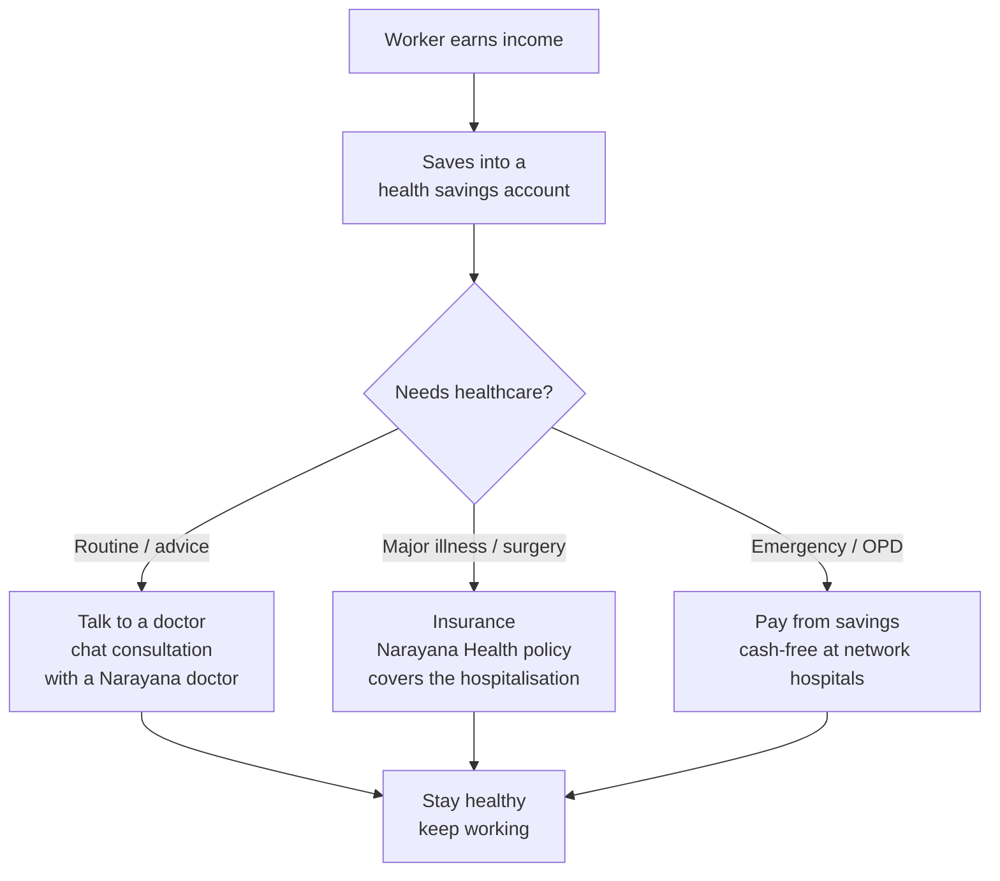

<p align="center">
  
</p>

## Are you ok?

That's what "Aarokya" asks — it's a name that phonetically echoes *"Are you ok?"*, rooted in the Sanskrit word for wholistic wellbeing. For India's delivery riders, drivers, domestic workers, and construction workers, the answer has too often been: *not really*.

Aarokya changes that. It's a healthcare super-app that brings together a health savings account, affordable insurance, and on-demand doctor access — all in one place, built for people who've never had any of this before.

---

## Who Is Aarokya For?

India has over **200 million gig workers** — delivery riders on Swiggy and Zomato, auto and cab drivers on Ola and Namma Yatri, domestic workers, construction laborers, and daily-wage earners across every city and town. These workers are:

- **Uninsured:** Most have never bought health insurance. Premiums feel inaccessible, the paperwork is confusing, and no one explains what is actually covered.
- **Unbanked or under-banked:** Many do not have savings set aside for a medical emergency. A hospitalization can wipe out months of earnings.
- **Without easy access to doctors:** Taking time off for a clinic visit means lost income. Specialist consultations feel expensive and distant.
- **Digitally capable but underserved:** These workers use smartphones every day for work — but fintech and health-tech apps are built for urban professionals, not for them.

Aarokya meets gig workers where they are: on their phone, in their language, with products priced for their income.

---

## The Problem We Solve

<CardGroup cols={3}>
  <Card title="No safety net" icon="triangle-exclamation" color="#dc2626">
    A single hospitalization costs ₹30,000–₹1,50,000 on average. Without insurance or savings, gig workers borrow from money lenders at high interest rates, or simply delay care until it is too late.
  </Card>
  <Card title="Insurance is opaque" icon="eye-slash" color="#f59e0b">
    Buying insurance requires understanding plan types, exclusions, waiting periods, and claim processes. For a first-time buyer, this is a wall of jargon that keeps them uninsured.
  </Card>
  <Card title="Doctors feel inaccessible" icon="hospital" color="#8b5cf6">
    A clinic visit costs time and money. Knowing what to tell a doctor — and getting the right specialist — is hard without any medical literacy. Symptoms get ignored until they become emergencies.
  </Card>
</CardGroup>

---

## How the Three Features Work Together



Savings, insurance, and consultations are not three separate products — they are one integrated safety net:

1. **Save regularly** — small, frequent contributions into a ring-fenced health savings account
2. **Stay covered** — preview the premium for a family and issue a Narayana Health policy in minutes
3. **Get care quickly** — open a consultation against an eligible benefit and chat with a doctor without leaving home

---

## The "Are you ok?" Brand Story

The name *Aarokya* works on two levels. In Sanskrit, *Ārogya* (आरोग्य) means the state of being free from disease — wholistic physical and mental wellbeing. But phonetically, when spoken aloud, it echoes the simple question: *"Are you ok?"*

That question is the product's core philosophy. In the age of AI and automation, gig workers are becoming invisible to the systems that serve them. Aarokya is a counter-statement: **in the age of AI, empathy will matter even more.** Every product decision — the password-free login that does not burden workers with credentials, the in-app consultation that connects them to a real doctor, the savings account that accepts small contributions without minimum-balance requirements — is designed to say, implicitly: *we see you, and we're asking if you're ok.*

---

<CardGroup cols={3}>
  <Card title="Health Savings" icon="wallet" color="#16a34a" href="/modules/account">
    A ring-fenced savings account that can receive contributions from the worker, their employer, their platform, or a sponsor. Money flows only toward healthcare.
  </Card>
  <Card title="Insurance" icon="shield-heart" color="#ec4899" href="/modules/insurance_policy">
    Preview the exact premium for a worker's family, preview the enrollment form, and issue a Narayana Health policy in minutes.
  </Card>
  <Card title="Consultations" icon="stethoscope" color="#8b5cf6" href="/modules/consultation">
    Open a consultation against an eligible benefit and chat with a Narayana doctor — messages, attachments, and read receipts, all in-app.
  </Card>
</CardGroup>

---

## Get Started in 3 Steps

Aarokya is a **partner-integrated** API: a platform (a mobility, delivery, or employer app) integrates Aarokya on behalf of its workers. The partner authenticates the worker and exchanges their phone number for a scoped token.

<Steps>
  <Step title="Provision a platform credential">
    An Aarokya admin creates a platform for the partner and mints a credential via `POST /platforms/{platform_id}/credentials`, which returns a `basic_token` once. The partner exchanges that `basic_token` with Keycloak (`client_credentials` grant) for a platform **service-account** JWT. See the [Platform module](/modules/platform).
  </Step>
  <Step title="Issue a user token">
    The partner backend calls `POST /auth/token` as its service account, passing the worker's phone number and an ID proof. Aarokya find-or-creates the user and returns a `user_id` and a JWT `access_token`.
    ```bash
    curl -X POST https://api.aarokya.in/auth/token \
      -H 'Authorization: Bearer <platform_service_token>' \
      -H 'Content-Type: application/json' \
      -d '{
        "phone_number": "9876543210",
        "phone_country_code": "+91",
        "id_proof": { "proof_type": "AADHAAR", "number": "123456789012" }
      }'
    ```
  </Step>
  <Step title="Call user-scoped endpoints">
    Pass the returned `access_token` as a Bearer header on every user-scoped request. The path `user_id` must match the token's user.
    ```bash
    curl https://api.aarokya.in/users/<user_id> \
      -H 'Authorization: Bearer <access_token>'
    ```
  </Step>
</Steps>

<Note>
  **Testing locally:** use `http://localhost:8080` as the base URL. See the repository README for seeding a platform and credential in development.
</Note>

---

## Explore

<CardGroup cols={2}>
  <Card title="API Reference" icon="code" href="/api/overview">
    Authentication, error codes, and the interactive Try It Out playground.
  </Card>
  <Card title="Module Guides" icon="book-open" href="/modules/overview">
    Deep dives into Auth, Platforms, Users, Accounts, Insurance Policies, Mandates, Consultations, and more.
  </Card>
  <Card title="System Architecture" icon="sitemap" href="/architecture/system-overview">
    How the mobile app, Rust backend, Juspay, and Narayana Health fit together.
  </Card>
  <Card title="Architecture Decisions" icon="lightbulb" href="/decisions/overview">
    Why Rust, why Smithy, and how we designed the auth system.
  </Card>
</CardGroup>

---

## Common Questions

<AccordionGroup>
  <Accordion title="Why does Aarokya not require passwords?">
    Aarokya does not own end-user authentication — that belongs to the partner app. The partner verifies the worker (typically a phone-based flow inside their own app), then exchanges the phone number for a scoped Aarokya token via `POST /auth/token`. This keeps Aarokya out of the credential-storage business entirely, and means workers never manage another password. The phone number acts as the identity anchor, which ties neatly into Aadhaar-based KYC when needed for insurance.
  </Accordion>
  <Accordion title="How is the health savings account different from a bank account?">
    The health savings account is **ring-fenced** — money in it can only be used for healthcare expenses. This is intentional: it prevents health savings from being spent on other expenses, which is the most common reason medical emergency funds disappear. Balances and movements are tracked as a ledger, and the account operates under the RBI Prepaid Payment Instrument (PPI) framework.
  </Accordion>
  <Accordion title="What happens if the user doesn't have insurance and gets hospitalised?">
    In that case they can use their savings balance to pay for OPD, pharmacy, and other covered expenses at network hospitals. Aarokya encourages buying insurance, but the savings account is immediately useful even before a policy is purchased. The app also surfaces insurance options at the moment of care — "you'd be covered for this if you had Plan X."
  </Accordion>
  <Accordion title="What is Narayana Health's role?">
    Narayana Health (NH) is one of India's largest hospital networks, known for making cardiac surgery affordable. They provide: (a) insurance plans that workers can buy through Aarokya, (b) the conversation gateway that powers in-app doctor consultations, and (c) a network of hospitals where covered care is delivered.
  </Accordion>
  <Accordion title="How is the platform structured?">
    Aarokya is a layered Rust backend whose API contracts are generated from Smithy models. The domains documented here — auth, platforms, users, dependants, accounts, MRNs, insurance policies, mandates and executions, orders, sponsors, the benefit catalogue, and consultations — each own their tables, business logic, and error types. See the [Modules overview](/modules/overview) for the full map.
  </Accordion>
  <Accordion title="How do I run the backend locally?">
    See the repository README for local setup. The backend requires PostgreSQL and a config file with the right secrets. Once running, the local base URL is `http://localhost:8080`.
  </Accordion>
</AccordionGroup>
